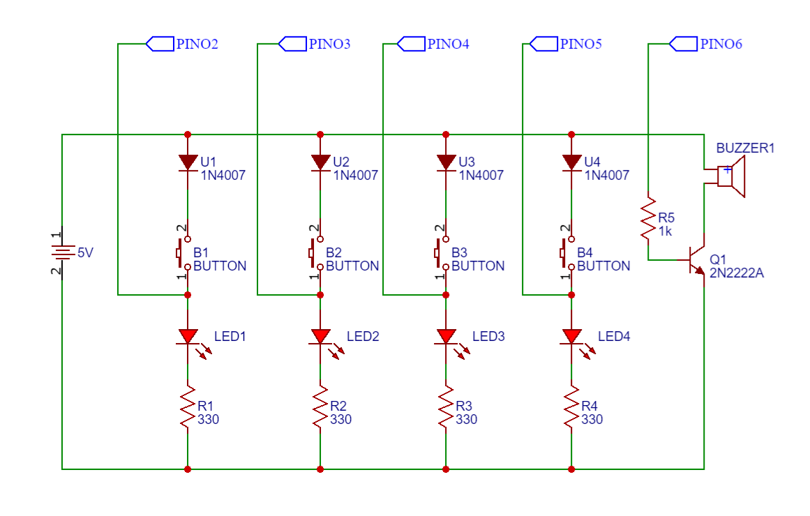

# Memory Game


[](LICENSE)

Jogo da memória desenvolvido utilizando **PlatformIO**, **Arduino** e **C++**.

O jogo gera uma sequência aleatória de luzes que é apresentada ao jogador. Em seguida, o jogador deve repetir exatamente a mesma sequência utilizando os botões correspondentes. A cada rodada, um novo passo é adicionado à sequência, aumentando progressivamente a dificuldade. O jogo continua até que o jogador cometa um erro, momento em que a partida é encerrada e reiniciada.

## Decisões de Projeto

A sequência do jogo é armazenada em um vetor de tamanho fixo em vez de uma lista encadeada.

Essa decisão foi tomada devido às limitações de memória do Arduino Uno (2 KB de SRAM). O uso de um vetor elimina alocações dinâmicas durante a execução, reduz a fragmentação de memória e garante um consumo previsível de recursos.

## Conceitos Aplicados

Durante o desenvolvimento foram utilizados conceitos como:

- Programação Orientada a Objetos (C++);
- Manipulação de GPIO;
- Temporização com Arduino;
- Geração de números pseudoaleatórios;
- Controle de estados;
- Estruturas de dados estáticas 
- Integração entre hardware e software.

## Funcionalidades

- Geração aleatória de sequências.
- Reprodução visual utilizando LEDs.
- Reprodução sonora utilizando buzzer.
- Leitura dos botões.
- Incremento automático da dificuldade.
- Reinício automático após erro.
---

## Hardware

Durante o desenvolvimento, foram utilizados diversos componentes eletrônicos com o objetivo de compreender seu funcionamento e aplicação prática.

### Componentes utilizados

- 1 Arduino Uno R3 (CH340)
- 4 LEDs
- 4 Diodos retificadores (1N4007)
- 4 Resistores de 330 Ω
- 4 Botões
- 1 Resistor de 1 kΩ
- 1 Buzzer ativo 5 V
- 1 Transistor BJT NPN (2N2222)

### Esquemático do circuito



---

## Estrutura do projeto

```text
.
├── .vscode/      # Configurações do Visual Studio Code
├── img/          # Imagens do projeto
├── include/      # Arquivos de cabeçalho (.h)
├── lib/          # Bibliotecas utilizadas
├── src/          # Código-fonte principal
└── test/         # Diretório reservado para testes do PlatformIO
```

---

## Tecnologias utilizadas

- C++
- Arduino Framework
- PlatformIO
- Visual Studio Code

---

## Como executar o projeto

### Pré-requisitos

- Visual Studio Code
- Git
- Extensão PlatformIO IDE

### Clonando o repositório

```bash
git clone https://github.com/RenanSoaresSouza/Memory-Game.git
```

### Executando

1. Abra a pasta do projeto no Visual Studio Code.
2. Abra o PlatformIO.
3. Selecione a placa **Arduino Uno**.
4. Compile o projeto.
5. Faça o upload para a placa.

---

## Autores

***Renan Soares Souza***

#### Este projeto foi desenvolvido para fins de estudo e aprendizado.

## 📄 Licença

Este projeto está licenciado sob a Licença MIT. Consulte o arquivo [LICENSE](LICENSE) para mais informações.


